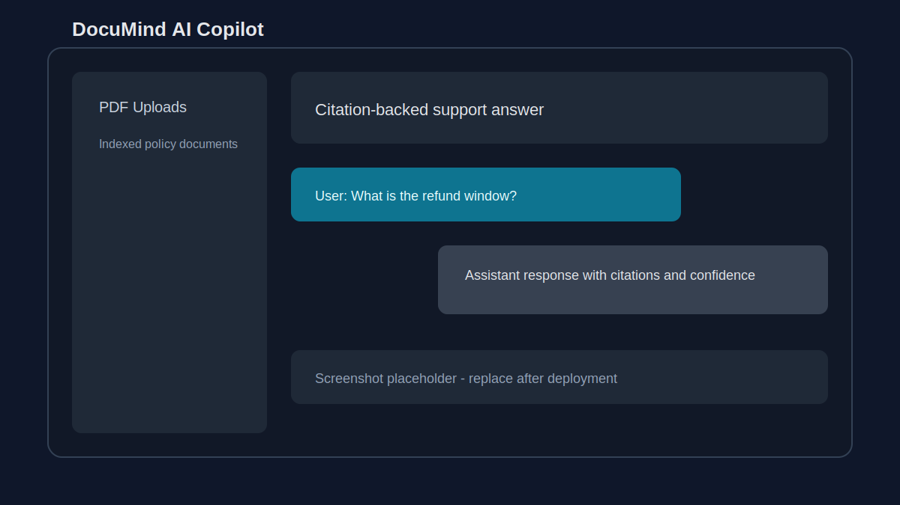
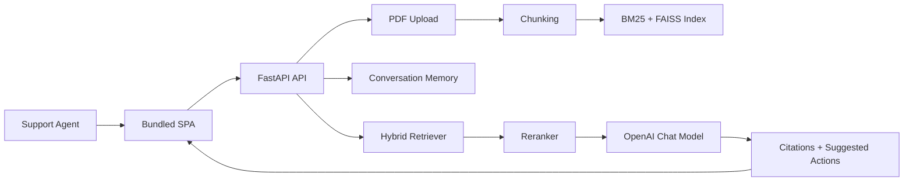

# DocuMind AI Copilot

AI customer-support copilot that answers policy questions with hybrid RAG, reranking, conversation memory, citations, and streaming responses.

## Live Demo

- Demo: Demo coming soon
- Local UI: `http://localhost:8000`
- Local API docs: `http://localhost:8000/docs`

## Visual Proof



Replace this placeholder with a real chat/upload screenshot after the hosted demo is available.

## Problem

Support teams need fast answers from company policies, but generic chatbots often miss context, hallucinate, or fail to explain where an answer came from. DocuMind indexes support documents and returns citation-backed responses with confidence and suggested next actions.

## Features

- PDF upload and document indexing.
- Hybrid retrieval with BM25 and FAISS.
- Reranking stage to improve final context quality.
- OpenAI chat and embedding configuration.
- Conversation memory window for follow-up questions.
- Standard JSON query endpoint and SSE streaming endpoint.
- Lightweight bundled SPA for upload and chat workflows.
- Docker and Render deployment configuration.

## Architecture



## Tech Stack

| Layer | Tools |
| --- | --- |
| API | FastAPI, Pydantic Settings, Uvicorn |
| RAG | PyMuPDF, LangChain text splitters, FAISS, rank-bm25 |
| LLM | OpenAI chat and embedding models |
| UI | Static HTML, CSS, JavaScript served by FastAPI |
| Deployment | Docker, Docker Compose, Render blueprint |
| Testing | Pytest smoke tests |

## Project Structure

```text
documind-ai-copilot/
├── app/
│   ├── rag/              # chunking, embeddings, retrieval, reranking, pipeline
│   ├── routes/           # health, upload, query, stream routes
│   ├── services/         # LLM, memory, suggestions
│   ├── static/           # bundled SPA
│   └── main.py
├── tests/                # API smoke tests
├── .env.example
├── DEPLOYMENT.md
├── Dockerfile
├── docker-compose.yml
└── render.yaml
```

## Setup

```bash
python -m venv .venv
source .venv/bin/activate
pip install -r requirements.txt
cp .env.example .env
uvicorn app.main:app --reload
```

Open `http://localhost:8000` for the UI or `http://localhost:8000/docs` for the API.

## Environment Variables

| Variable | Purpose |
| --- | --- |
| `OPENAI_API_KEY` | Optional locally, required for production-quality answers |
| `OPENAI_CHAT_MODEL` | Chat model used for response generation |
| `OPENAI_EMBEDDING_MODEL` | Embedding model for semantic retrieval |
| `LLM_TEMPERATURE` | Generation temperature |
| `CHUNK_SIZE` / `CHUNK_OVERLAP` | Document chunking controls |
| `TOP_K_RETRIEVAL` | Number of retrieved candidates |
| `BM25_WEIGHT` / `VECTOR_WEIGHT` | Hybrid retrieval weighting |
| `RERANK_ENABLED` | Enables reranking stage |
| `MEMORY_WINDOW_SIZE` | Number of recent turns used as memory |
| `DATA_DIR` | Local document index directory |

## Usage and API

Health:

```bash
curl http://localhost:8000/api/v1/health
```

Upload a PDF:

```bash
curl -X POST http://localhost:8000/api/v1/upload \
  -F "files=@examples/Company_Refund_Policy.pdf"
```

Ask a question:

```bash
curl -X POST http://localhost:8000/api/v1/query \
  -H "Content-Type: application/json" \
  -d '{"question":"What is the refund window?","session_id":"demo"}'
```

Stream a response:

```bash
curl -N -X POST http://localhost:8000/api/v1/chat/stream \
  -H "Content-Type: application/json" \
  -d '{"question":"Summarize the refund policy.","session_id":"demo"}'
```

## RAG Approach

1. Uploaded PDFs are parsed into text.
2. Text is chunked with overlap to preserve local context.
3. The system builds lexical and vector indexes.
4. Query candidates are retrieved with BM25 and FAISS.
5. A reranker selects the strongest context.
6. The LLM receives retrieved context and recent memory.
7. The response includes citations, confidence, and suggested actions.

## Evaluation

Current evaluation is implemented as smoke-level validation. Before using this in a real support workflow, add a labeled support-policy question set and track:

- Retrieval hit rate against expected source documents.
- Citation coverage.
- Answer faithfulness from policy text.
- Escalation quality for low-confidence or unsupported questions.
- p50/p95 latency for `/query` and `/chat/stream`.

## Deployment

Use Render or Railway for the FastAPI service. The app is not a good fit for Vercel serverless because it keeps local indexes and serves streaming responses.

See `DEPLOYMENT.md` for the Render/Railway plan and production checklist.

## Roadmap

- Add a seeded evaluation dataset for policy QA.
- Add persistent vector storage for multi-instance deployments.
- Add authentication for uploads and admin actions.
- Add CI gates for tests and linting.
- Add demo deployment with sample policy documents.

## Author

Yash Sharma - MCA AI/ML student focused on RAG, NLP, GenAI, and production backend AI systems.
